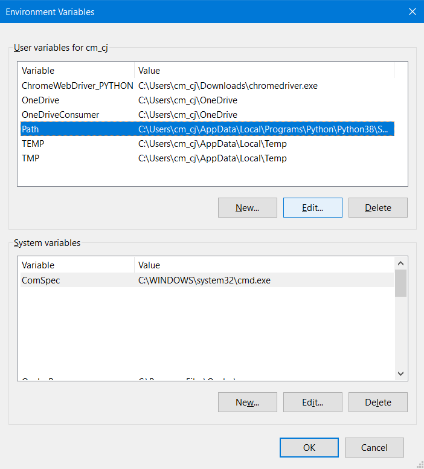
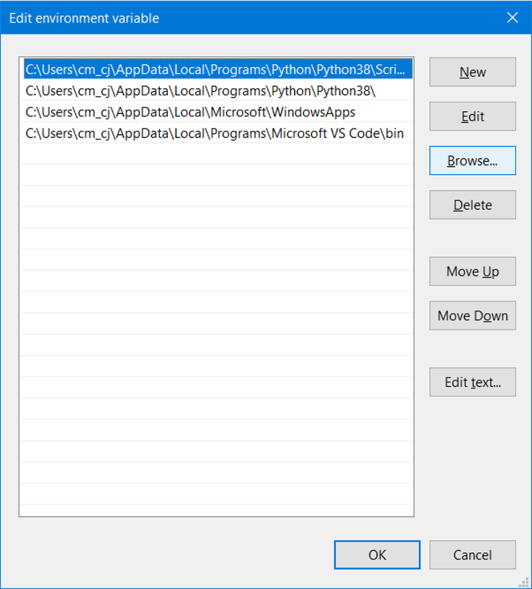

# Syntax Highlighter C++

### Description
This is a syntax highlighter for **Windows** written on **C++** using regular expressions powered by **Flex** to identify tokens on a text file.  
Executing the file "**a.exe**" reads an input file ("input.txt") and detects different keywords that are sort of shared across C++, Python and MatLab.  
After that, it generates an HTML file ("index.html"), this file is the result of highlighting the input file.
The styles are predefined on a CSS file and is strictly related to the tokens coded con C++/FLEX.

### Example:
#### Input file: [input.txt](https://cristiancazares.github.io/SyntaxHighlighter/input.txt)
#### Syntax highlighted: [Here](https://cristiancazares.github.io/SyntaxHighlighter/)

## Author: Cristian Javier Cázares Molina

This is a walkthrough of my entire project. If you want to start developing, you can simply jump to the section of [Prerequsites](#Prerequisites). 

## Table of contents
* [Selected languages](#SelectedLanguages)
* [Regular expressions](#RegularExpressions)
* [Target tokens](#TargetTokens)
* [Prerequisites ](#Prerequisites)
	* [Flex / Lex & Yacc](#FlexLexYacc)
	* [Things to install](#ToInstall)
		* [MinGW-w64](#MinGW-w64)
		* [GnuWin32](#GnuWin32)
* [Code development](#CodeDevelopment)
	* [C++](#CSS) 
	* [HTML + CSS](#HTMLCSS) 
	* [How to add a new token?](#NewToken) 
* [Compiling](#Compiling)
	* [Commands for compiling (Windows CMD)](#CommandsCMD)
* [Execution](#Execution)
* [Testing](#Testing)

## Selected languages 

**C++, Python y Matlab.**
The program is looking for some keywords that are (kind of) shared between three coding languages from different families. 
There is no doubt that Python and C++ are from different families. On the other hand, MatLab has lots of expressions based on C, nevertheless it also has pretty particular differences, such as "function" to declare functions.

## Target tokens 
After comparing the shared reserved keywords across languages, in the next table I illustrate the principal tokens categories and the highlight color selected. 
Also, I include a column for some posible examples and another one for related and/or extra tokens.

## Regular expressions 
Some tokens only demand simple expressiones ("token"). In the next table are the more -sort of- complex tokens:
|Token|Regular Expression|
|--|--|
|Real Numbers|[-]?[0-9]*\.?[0-9]+([eE][-+]?[0-9]+)?|
|Quotations|(\\/\\/)(.*)\|#[^include].\*|
|Imports|“import"\|"#include"|
|Operators|+\|-\|*\|/\|%\|^\|<\|>|
|False|"false"\|"False"|
|True|"true"\|"True"|
|Alphabetical|[A-Za-z]+|	
There is a total of 38 different tokens. Of those, 30 are simple of the form "token".

## Prerequisites 
### Flex / Lex & Yacc 
The most fundamental part of the program is the lexer analyser. The go-to lexer when developing on C++ is Lex & Yacc. However, this is only available on Unix systems. 
The equivalent for Windows is **Flex** and Bison. For the purpose of this project, we will only be needing **Flex**. 

This part was the most difficult on my experience, because the compiler that I was using was having some troubles with Flex and missing some files. In my experience this is what worked best:

### Things to install 
#### Be aware of the location of every installation. You are going to need the,
#### MinGW-w64 
The compiler that I used is g++, which is part of the **MinGW-w64** project.
You can find the official installer on the section of **Mingw-builds>Souforge** of [this page](https://www.mingw-w64.org/downloads/#mingw-builds). 

**If you already have a C++ compiler** on your system, you can skip this ([jump to next](#GenuWin32)). In event of problems with your compiler, reinstalling the after mention one might work.

For some reason, that installer had issues on my computer (64bit). If this is your case try downloading [this MinGW build (x86_64-8.1.0-release-posix-seh-rt_v6-rev0.7z](https://sourceforge.net/projects/mingw-w64/files/Toolchains%20targetting%20Win64/Personal%20Builds/mingw-builds/8.1.0/threads-posix/seh/). Just uncompress it and move the folder to a general directorie, such as C:\ or C:\Program Files.

#### GnuWin32: Flex 
Flex is part of the GnuWin32 project, which is a set of open source tools for C and C++. 
I recommend installing the full [Set Up from here](http://gnuwin32.sourceforge.net/packages/flex.htm). 

### Add MinGW and GnuWin32 to PATH
In order to use Flex and g++ everywhere through console, you must add them to PATH.  
Both of them contain a folder called "bin". That is the folder that must be added to PATH.

1. Press the Windows Key and search "Edit the System Environment Variables".

2. Go to "Envirnoment Variables...". This is going to open a new window.

3. From the User Variables (the list on the top) double click on "Path". This is going to open a new window.

4. Now click on "Browse" go to where you have the MinGW look for a folder called "bin" and click "ok"

5. Do the same thing with the "bin" folder of GnuWin32.

## Code development 
### C++ 
### HTML + CSS 
### How to add a new token?
## Compiling 
### Commands for compiling (Windows CMD) 

## Execution 

## Testing 
